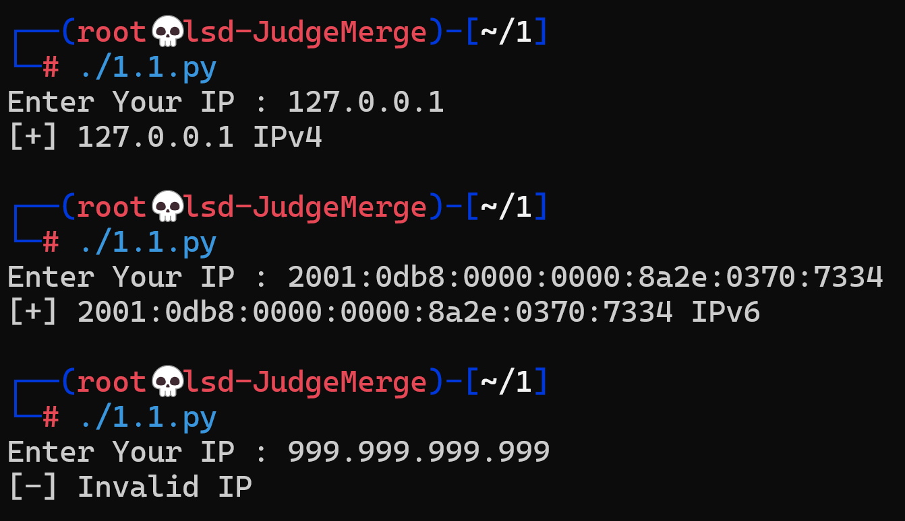
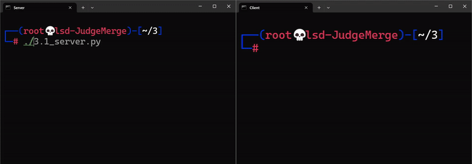

# Skill 2 [Network]

# **اقْتَرَبَ لِلنَّاسِ حِسَابُهُمْ وَهُمْ فِي غَفْلَةٍ مُعْرِضُونَ**

---

# Level 1️⃣ : IP Addresses & Subnetting

## Topics :

### 1) IP Basics

### 2) IPv4

### 3) IPv6

### 4) Subnetting

### 5) CIDR Notation

## 1.1

### **validates whether a given IP address is IPv4 or IPv6.**

```python
#!/usr/bin/python3

def isIPv4(ip): 
    octets = ip.split('.')

    if len(octets) != 4:
        return False

    for i in octets:
        i = int(i)
        if i < 0 or i > 255:
            return False
    
    return True
    
def isIPv6(ip):
    octets = ip.split(':')

    pool = "01213456789abcdefABCDEF"

    if len(octets) > 8:
        return False
    
    for i in octets:
        for j in i:
            if j not in pool:
                return False
            
    return True

ip = input("Enter Your IP : ")

if isIPv4(ip):
    print(f"[+] {ip} IPv4")

elif isIPv6(ip):
    print(f"[+] {ip} IPv6")

else:
    print("[-] Invalid IP")

```



## 1.2

### Convert an IPv4 address from dotted-decimal to binary format

```python
#!/usr/bin/python3

def isIPv4(ip): 
    octets = ip.split('.')

    if len(octets) != 4:
        return False

    for i in octets:
        i = int(i)
        if i < 0 or i > 255:
            return False
    
    return True

ip = input("Enter Your IP : ")

if isIPv4(ip):
    octets = ip.split('.')
    new_octets = []
    for i in octets:
        new_octets.append(f"{int(i):08b}")
    print(".".join(new_octets))

else:
    print("[-] Invalid IP!!")
```


## 1.3

### Extract all IP addresses from a text file

```python
#!/usr/bin/python3

def isIPv4(ip): 
    octets = ip.split('.')

    if len(octets) != 4:
        return False

    for i in octets:
        i = int(i)
        if i < 0 or i > 255:
            return False
    
    return True

valid_ips = []

test = open("files/sample.txt", 'r')

temp = ""
pool = "0123456789."

for i in test.read():
    if i in pool:
        temp += i
    
    else:
        if isIPv4(temp):
            valid_ips.append(temp)
        temp = ""

print(valid_ips)

'''
cat files/sample.txt 
Here are some IP addresses:
- Valid: 192.168.1.1
- Also Valid: 8.8.8.8
- Internal IP: 10.0.0.1

Some garbage: 999.999.999.999,
not-an-ip, 172.16.300.1
Text continues here without IPs.
And another IP: 127.0.0.1
'''
```


## 1.4

## Checks if an IP belongs to a private network (192.168.x.x, 10.x.x.x, etc)

```python
#!/usr/bin/python3

def isIPv4(ip): 
    octets = ip.split('.')

    if len(octets) != 4:
        return False

    for i in octets:
        i = int(i)
        if i < 0 or i > 255:
            return False
    
    return True

def isPrivateIP(ip):
    octets = ip.split('.')

    # Private (A)
    if(octets[0] == "10"):
        return True
    # Private (B)
    elif (octets[0] == "172" and (int(octets[1]) >= 16 and int(octets[1]) <= 31)):
        return True
    # Private (C)
    elif (octets[0] == "192") and (octets[1] == "168"):
        return True
    # Link-Local
    elif (octets[0] == "192") and (octets[1] == "168"):
        return True
    # Loopback
    if(octets[0] == "127"):
        return True
    # CGNAT(ISPs)
    elif (octets[0] == "100" and (int(octets[1]) >= 64 and int(octets[1]) <= 127)):
        return True
    else:
        return False

ip = input("Enter Your IP : ")

if isIPv4(ip):
    if isPrivateIP(ip):
        print("Your Ip Is PRIVATE!!")
    else:
        print("Your IP Is NOT PRIVATE!!")
else:
    print("[-] Invalid IP!!")
```


## 1.5

### Given an IP and subnet mask, calculate the network address and broadcast address

```python
#!/usr/bin/python3

def isIPv4(ip): 
    octets = ip.split('.')

    if len(octets) != 4:
        return False

    for i in octets:
        i = int(i)
        if i < 0 or i > 255:
            return False
    
    return True

def calcNetworkAddress(ip, mask):
    ip_octets = ip.split('.')
    mask_octets = mask.split('.')
    network_address = []

    for i in range(len(ip_octets)):
        network_address.append(str(int(ip_octets[i]) & int(mask_octets[i])))

    return ".".join(network_address)

def calcBroadCastAddress(ip, mask):
    ip_octets = ip.split('.')
    mask_octets = mask.split('.')
    not_mask_octets = []
    brodcast_address = []

    for i in mask_octets:
        not_mask_octets.append(255 - int(i))

    for i in range(len(ip_octets)):
        brodcast_address.append(str(int(ip_octets[i]) | int(not_mask_octets[i])))
    
    return ".".join(brodcast_address)
    

ip = input("Enter Your Ip : ")
mask = input("Enter Your Subnet Mask : ")

if isIPv4(ip):
    print(f"Network Address : {calcNetworkAddress(ip, mask)}")
    print(f"Brodcast Address : {calcBroadCastAddress(ip, mask)}")

else:
    print("[-] Invalid IP!!")
```


## 1.6

### Generate a list of all possible IPs in a given subnet (192.168.1.0/24)

```python
#!/usr/bin/python3

def isIPv4(ip): 
    octets = ip.split('.')

    if len(octets) != 4:
        return False

    for i in octets:
        i = int(i)
        if i < 0 or i > 255:
            return False
    
    return True

ip = input("Enter Your IP (127.0.0.1/24) : ")

if isIPv4(ip.split('/')[0]):
    mask = int(ip.split('/')[1])
    print(f"Available IPs = {2 ** (32 - mask) - 2}")
else:
    print("[-] Invalid IP!!")
```


## 1.7

### Create a script that checks if an IP is reachable by pinging it

```python
#!/usr/bin/python3

import os

def isIPv4(ip): 
    octets = ip.split('.')

    if len(octets) != 4:
        return False

    for i in octets:
        i = int(i)
        if i < 0 or i > 255:
            return False
    
    return True

ip = input("Enter Your IP : ")

if isIPv4(ip):
  os.system(f"ping -n 1 {ip}")
  
else:
  print("Invalid IP!!")
```


## 1.8

### Convert an IPv6 address to its compressed and expanded forms

```python
#!/usr/bin/python3

import ipaddress

def isIPv6(ip):
  try:
    ip_obj = ipaddress.ip_address(ip)
    if ip_obj.version == 6:
      return True
  except ValueError:
    return False

def ipv6_forms(ip):
  ip_obj = ipaddress.ip_address(ip)
  print(f"[+] {ip} -> Compressed: {ip_obj.compressed}")
  print(f"[+] {user_ip} -> Expanded: {ip_obj.exploded}")

user_ip = input("Enter an IPv6 : ").strip();

if isIPv6(user_ip):
  ipv6_forms(user_ip)
else:
  print(f"[!] {user_ip} -> Invalid!!")
```


## 1.9

### **Write a function that determines the class of an IPv4 address (A, B, C, D, E)**

```python
#!/usr/bin/python3

def get_ip_class(ip_address):
    try:
        first_octet = int(ip_address.split('.')[0])

        if 1 <= first_octet <= 126:
            return "Class A"
        elif first_octet == 127:
            return "Class A (Loopback Address)"
        elif 128 <= first_octet <= 191:
            return "Class B"
        elif 192 <= first_octet <= 223:
            return "Class C"
        elif 224 <= first_octet <= 239:
            return "Class D (Multicast)"
        elif 240 <= first_octet <= 254:
            return "Class E (Experimental)"
        else:
            return "Invalid IP Range"
    except:
        return "Invalid IP format"

ip = input("Enter An IP : ");

print("Your Ip Is : ", end="");
print(get_ip_class(ip));
```


## 1.10

### **Given two IPs, determine if they belong to the same subnet.**

```python
#!/usr/bin/python3

import ipaddress

def isIPv4(ip):
  try:
    ip_obj = ipaddress.ip_address(ip)
    return ip_obj.version == 4
  except ValueError:
    return False

def calcNetworkAddress(ip, mask):
    ip_octets = ip.split('.')
    mask_octets = mask.split('.')
    network_address = []

    for i in range(len(ip_octets)):
        network_address.append(str(int(ip_octets[i]) & int(mask_octets[i])))

    return ".".join(network_address)

ip1 = input("Enter IP1 : ")
mask1 = input("Enter Subnet Mask (IP1) : ")

ip2 = input("Enter IP2 : ")
mask2 = input("Enter Subnet Mask (IP2) : ")

try:
    if mask1 == mask2:
        network_address1 = calcNetworkAddress(ip1, mask1)
        network_address2 = calcNetworkAddress(ip2, mask2)
        if network_address1 == network_address2:
           print("Both IPs In The Same Subnet")
        else:
           print("Both IPs Are NOT In The Same Subnet")
    else:
        print("Both IPs Are NOT In The Same Subnet")

except:
   print("Syntax Erro, Try IPv4 Only")
```


---

# Level 2️⃣ : Ports & Protocols

## Topics :

### 1)  Port Numbers

### 2)  Well-Known Ports

### 3)  Protocols (TCP/UDP)

## 2.1

### **Print a list of common ports and their corresponding services (e.g., 80 → HTTP)**

```python
#!/usr/bin/python3

status_codes = {200: "OK", 404: "Not Found", 500: "Internal Server Error", 403: "Forbidden", 301: "Moved Permanently"}
print(status_codes)

```


## 2.2

### **Write a function that checks if a given port number is valid (0-65535)**

```python
#!/usr/bin/python3

port = int(input("Enter Your Port (1-65535) : "))

if port in range(1, 65536):
  print("[+] Valid Port!!")
else:
  print("[-] Invalid Port!!")
```


## 2.3

### **Write a script that scans the first 1000 ports of a given IP to see if they are open**

```python
#!/usr/bin/python3

import nmap

scanner = nmap.PortScanner()

ip = input("Enter Target IP : ")

scanner.scan(ip, "1-1000")

for port in scanner[ip]['tcp']:
    if scanner[ip]['tcp'][port]['state'] == 'open':
        print(f"[+] port {port}")

```


## 2.4

### **Detects whether a given port uses TCP or UDP**

```python
#!/usr/bin/python3

import nmap

nm = nmap.PortScanner()

host = input("Enter Your Host (ex. 142.250.185.238) : ")
port = int(input("Enter Your Port (ex. 443) : "))   

result = {"tcp": False, "udp": False}

# --- TCP scan ---
nm.scan(host, str(port), arguments='-sT -Pn')
if (host in nm.all_hosts()
    and 'tcp' in nm[host]
    and port in nm[host]['tcp']      
    and nm[host]['tcp'][port]['state'] == 'open'):
    result["tcp"] = True

# --- UDP scan ---
nm.scan(host, str(port), arguments='-sU -Pn')
if (host in nm.all_hosts()
    and 'udp' in nm[host]
    and port in nm[host]['udp']      
    and nm[host]['udp'][port]['state'] in ['open', 'open|filtered']):
    result["udp"] = True

print(result)

```


## 2.5

### **Randomly generate 5 open ports between 1024-65535**

```python
#!/usr/bin/python3

import random

for i in range(1, 6):
    print(f"{i}) {random.randint(1024, 65535)}")
```


## 2.6

### **Create a function that tells whether a given port is in the privileged range (0-1023)**

```python
#!/usr/bin/python3

def isPrivileged(port):
    return port in range(0, 1024)

port = int(input("Enter Your Port : "))

if isPrivileged(port):
    print(f"[+] {port} Privileged")
else :
    print(f"[-] {port} NOT Privileged")
```


## 2.7

### **Write a script that finds all listening ports on your local machine (127.0.0.1)**

```python
#!/usr/bin/python3

import nmap

nm = nmap.PortScanner()

target = "127.0.0.1"

print(f"[+] Scanning {target} for listening ports...\n")

# Scan TCP + UDP, reserved + high ports
nm.scan(target, arguments='-sT -sU -Pn')

# ---- TCP Results ----
if 'tcp' in nm[target]:
    print("[TCP]")
    for port, info in nm[target]['tcp'].items():
        if info['state'] == 'open':
            print(f"  {port}/tcp  OPEN")

# ---- UDP Results ----
if 'udp' in nm[target]:
    print("\n[UDP]")
    for port, info in nm[target]['udp'].items():
        if info['state'] in ('open', 'open|filtered'):
            print(f"  {port}/udp  {info['state'].upper()}")

```


## 2.8

### Implement a basic TCP port scanner using Python’s socket module

```python
#!/usr/bin/python3

import socket

host = input("Enter host (ex. 127.0.0.1): ").strip()

# Scan ports 1–1024 (you can change this)
for port in range(1, 1025):
    s = socket.socket(socket.AF_INET, socket.SOCK_STREAM)
    s.settimeout(0.5)

    try:
        result = s.connect_ex((host, port))
        if result == 0:
            print(f"[+] OPEN  {port}/tcp")
    finally:
        s.close()
```


## 2.9

### **Implement a basic UDP port scanner**

```python
#!/usr/bin/python3

import nmap

host = input("Enter host (ex. 127.0.0.1): ").strip()

nm = nmap.PortScanner()

# Scan UDP ports 1–1024
nm.scan(host, arguments='-sU -Pn')

if 'udp' in nm[host]:
    for port, info in nm[host]['udp'].items():
        state = info['state']
        if state in ('open', 'open|filtered'):
            print(f"[+] {port}/udp  {state.upper()}")
```


## 2.10

### **List all reserved ports (1-1023) that are commonly used in hacking**

```python
#!/usr/bin/python3

common_ports = {
    20:  "FTP-Data",
    21:  "FTP",
    22:  "SSH",
    23:  "Telnet",
    25:  "SMTP",
    53:  "DNS",
    67:  "DHCP-Server",
    68:  "DHCP-Client",
    69:  "TFTP",
    80:  "HTTP",
    110: "POP3",
    111: "RPCbind",
    135: "Microsoft RPC",
    137: "NetBIOS Name Service",
    138: "NetBIOS Datagram Service",
    139: "NetBIOS Session Service",
    143: "IMAP",
    161: "SNMP",
    389: "LDAP",
    443: "HTTPS",
    445: "SMB",
    514: "Syslog",
    873: "rsync",
    993: "IMAPS",
    995: "POP3S"
}

for key, value in common_ports.items():
    print(f"{key} => {value}")

```


---

# Level 3️⃣ :  TCP & UDP

## Topics :

### 1) Indexing

### 2) Iteration

### 3) Dictionary Lookups

## 3.1

### **Create a list of 10 hacker tools**

```python
#!/usr/bin/python3

tools = [
"Nmap", 
"Wireshark", 
"Metasploit", 
"Aircrack-ng", 
"Burp Suite", 
"John the Ripper", 
"Hydra", 
"Nikto", 
"Cain and Abel", 
"Netcat"
]

print(tools)
```


## 3.2

### **Print the 3rd item in the list**

```python
#!/usr/bin/python3

tools = [
"Nmap", 
"Wireshark", 
"Metasploit", 
"Aircrack-ng", 
"Burp Suite", 
"John the Ripper", 
"Hydra", 
"Nikto", 
"Cain and Abel", 
"Netcat"
]

print(f"3rd Element Of List : {tools[2]}")
```


## 3.3

### **Create a dictionary storing common HTTP status codes and their meanings**

```python
#!/usr/bin/python3

codes = {200: "OK", 404: "Not Found"}

print(codes)
```


## 3.4

### **Write a program that counts how many times each letter appears in a string**

```python
#!/usr/bin/python3

chars_map = {}

str = input("Enter Any Word : ")

for i in str:
    if i in chars_map.keys():
        chars_map[i] += 1
    else:
        chars_map[i] = 1

print(f'Analyisis Of Word "{str}" : ')

for key, value in chars_map.items():
    print(f"{key} -> {value}")
```


## 3.5

### **Sort a list of random numbers [without using .sort()]**

```python
#!/usr/bin/python3

arr = [5, 4, 2, 1, 7, 3, 6]

print(f"Before : {arr}")

# Using Manual [Bubble Sort]
for i in range(len(arr)):
    temp = 0
    for j in range(len(arr) - i - 1):
        if arr[j] > arr[j + 1]: # Swap arr[j] & arr[j + 1]
            temp = arr[j]
            arr[j] = arr[j + 1]
            arr[j + 1] = temp

print(f"After  : {arr}")
```


## 3.6

### Store ports and their corresponding services in a dictionary and allow the user to query by port number

```python
#!/usr/bin/python3

ports = {
	20:"FTP", 
	21:"FTP", 
	22:"SSH", 
	80:"HTTP", 
	8080:"HTTP", 
	443:"HTTPS", 
	3306:"MySQL"
}

for key in ports.keys():
    print(f"Opend {key}")

while True:
    choose = input("Choose Port (Enter 'q' To Exit) : ")
    if choose == 'q':
        break

    choose = int(choose)

    if choose in ports:
        print (f"{choose} : {ports[choose]}")

    else:
        print("Invalid Port!!")
```


## 3.7

### **Write a function that removes duplicates from a list**

```python
#!/usr/bin/python3

def rem_duplicate(arr):
    temp_arr = []
    for i in arr:
        if i not in temp_arr:
            temp_arr.append(i)
    return temp_arr

myArr = ["abc", 123, "Maro", 123, "abc"]

print(f"Before : {myArr}")

myArr = rem_duplicate(myArr)

print(f"After  : {myArr}")
```


## 3.8

### **Convert a list into a comma-separated string**

```python
#!/usr/bin/python3

arr = ["Apple", "Banana", "Cherry"]

print(f"Before : {arr}")

print(f"After  : {','.join(arr)}")
```


## 3.9

### **Write a function that finds the longest word in a list**

```python
#!/usr/bin/python3

def getLongestWord(arr):
    mx = 0
    temp = ""
    for i in arr:
        if len(i) > mx:
            mx = len(i)
            temp = i
    return temp

myArr = ["a", "ab", "abc", "Maroooooo"]

print(f"Original List {myArr}")

print(f'Longest Word is "{getLongestWord(myArr)}"')
```


## 3.10

### **Given a dictionary of usernames and passwords, write a script that asks for a username and prints the stored password**

```python
#!/usr/bin/python3

credentials = {
	"root": "root",
	"kali": "kali",
	"user": 123456
}

print("You Hacked Users DataBase :) \nWhich One You Want To Show It's Password? : ")

num = 1

for key in credentials.keys():
    print(f"{num}) {key}")
    num += 1

user = input()

print(f"{user} : {credentials[user]}")
```


## Topics :

### 1)  Connection-oriented vs. Connectionless

### 2)  Sockets

### 3)  Packet Handling

## 2.1

### **Write a simple TCP client-server program that sends a message from client to server**

```python
#!/usr/bin/python3
# ================================
# ||         server.py          ||
# ================================
import socket

HOST = '127.0.0.1'   # Localhost
PORT = 5000          # Port to listen on

server_socket = socket.socket(socket.AF_INET, socket.SOCK_STREAM)
server_socket.bind((HOST, PORT))
server_socket.listen(1)

print(f"[+] Server listening on {HOST}:{PORT}")

conn, addr = server_socket.accept()
print(f"[+] Connected by {addr}")

data = conn.recv(1024).decode()
print(f"[+] Received message: {data}")

conn.close()
server_socket.close()
```

```python
#!/usr/bin/python3

# ================================
# ||         client.py          ||
# ================================

import socket

HOST = '127.0.0.1'   # Server IP
PORT = 5000          # Server Port

client_socket = socket.socket(socket.AF_INET, socket.SOCK_STREAM)
client_socket.connect((HOST, PORT))

message = "Hello from client!"
client_socket.send(message.encode())

client_socket.close()
```



## 2.2

### **Write a function that checks if a given port number is valid (0-65535)**

```python
#!/usr/bin/python3

port = int(input("Enter Your Port (1-65535) : "))

if port in range(1, 65536):
  print("[+] Valid Port!!")
else:
  print("[-] Invalid Port!!")
```


## 2.3

### **Write a script that scans the first 1000 ports of a given IP to see if they are open**

```python
#!/usr/bin/python3

import nmap

scanner = nmap.PortScanner()

ip = input("Enter Target IP : ")

scanner.scan(ip, "1-1000")

for port in scanner[ip]['tcp']:
    if scanner[ip]['tcp'][port]['state'] == 'open':
        print(f"[+] port {port}")

```


## 2.4

### **Detects whether a given port uses TCP or UDP**

```python
#!/usr/bin/python3

import nmap

nm = nmap.PortScanner()

host = input("Enter Your Host (ex. 142.250.185.238) : ")
port = int(input("Enter Your Port (ex. 443) : "))   

result = {"tcp": False, "udp": False}

# --- TCP scan ---
nm.scan(host, str(port), arguments='-sT -Pn')
if (host in nm.all_hosts()
    and 'tcp' in nm[host]
    and port in nm[host]['tcp']      
    and nm[host]['tcp'][port]['state'] == 'open'):
    result["tcp"] = True

# --- UDP scan ---
nm.scan(host, str(port), arguments='-sU -Pn')
if (host in nm.all_hosts()
    and 'udp' in nm[host]
    and port in nm[host]['udp']      
    and nm[host]['udp'][port]['state'] in ['open', 'open|filtered']):
    result["udp"] = True

print(result)

```


## 2.5

### **Randomly generate 5 open ports between 1024-65535**

```python
#!/usr/bin/python3

import random

for i in range(1, 6):
    print(f"{i}) {random.randint(1024, 65535)}")
```


## 2.6

### **Create a function that tells whether a given port is in the privileged range (0-1023)**

```python
#!/usr/bin/python3

def isPrivileged(port):
    return port in range(0, 1024)

port = int(input("Enter Your Port : "))

if isPrivileged(port):
    print(f"[+] {port} Privileged")
else :
    print(f"[-] {port} NOT Privileged")
```


## 2.7

### **Write a script that finds all listening ports on your local machine (127.0.0.1)**

```python
#!/usr/bin/python3

import nmap

nm = nmap.PortScanner()

target = "127.0.0.1"

print(f"[+] Scanning {target} for listening ports...\n")

# Scan TCP + UDP, reserved + high ports
nm.scan(target, arguments='-sT -sU -Pn')

# ---- TCP Results ----
if 'tcp' in nm[target]:
    print("[TCP]")
    for port, info in nm[target]['tcp'].items():
        if info['state'] == 'open':
            print(f"  {port}/tcp  OPEN")

# ---- UDP Results ----
if 'udp' in nm[target]:
    print("\n[UDP]")
    for port, info in nm[target]['udp'].items():
        if info['state'] in ('open', 'open|filtered'):
            print(f"  {port}/udp  {info['state'].upper()}")

```


## 2.8

### Implement a basic TCP port scanner using Python’s socket module

```python
#!/usr/bin/python3

import socket

host = input("Enter host (ex. 127.0.0.1): ").strip()

# Scan ports 1–1024 (you can change this)
for port in range(1, 1025):
    s = socket.socket(socket.AF_INET, socket.SOCK_STREAM)
    s.settimeout(0.5)

    try:
        result = s.connect_ex((host, port))
        if result == 0:
            print(f"[+] OPEN  {port}/tcp")
    finally:
        s.close()
```


## 2.9

### **Implement a basic UDP port scanner**

```python
#!/usr/bin/python3

import nmap

host = input("Enter host (ex. 127.0.0.1): ").strip()

nm = nmap.PortScanner()

# Scan UDP ports 1–1024
nm.scan(host, arguments='-sU -Pn')

if 'udp' in nm[host]:
    for port, info in nm[host]['udp'].items():
        state = info['state']
        if state in ('open', 'open|filtered'):
            print(f"[+] {port}/udp  {state.upper()}")
```


## 2.10

### **List all reserved ports (1-1023) that are commonly used in hacking**

```python
#!/usr/bin/python3

common_ports = {
    20:  "FTP-Data",
    21:  "FTP",
    22:  "SSH",
    23:  "Telnet",
    25:  "SMTP",
    53:  "DNS",
    67:  "DHCP-Server",
    68:  "DHCP-Client",
    69:  "TFTP",
    80:  "HTTP",
    110: "POP3",
    111: "RPCbind",
    135: "Microsoft RPC",
    137: "NetBIOS Name Service",
    138: "NetBIOS Datagram Service",
    139: "NetBIOS Session Service",
    143: "IMAP",
    161: "SNMP",
    389: "LDAP",
    443: "HTTPS",
    445: "SMB",
    514: "Syslog",
    873: "rsync",
    993: "IMAPS",
    995: "POP3S"
}

for key, value in common_ports.items():
    print(f"{key} => {value}")

```

